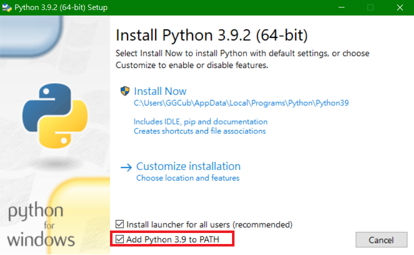
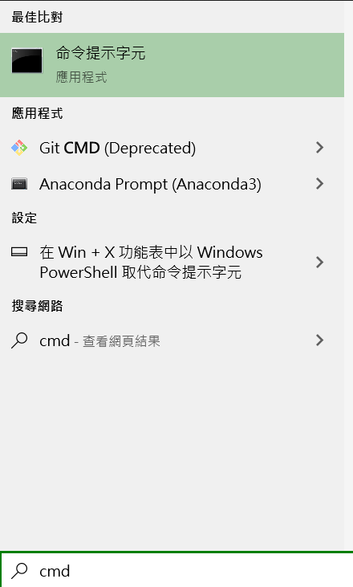
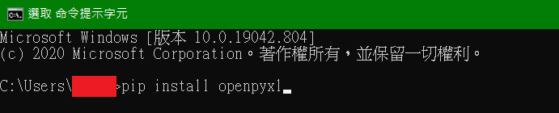

# 課表查詢系統操作說明
## 事前安裝軟體
### 安裝 python
   電腦需安裝 python 程式 (建議3.7版本以上)  
   連結網址：
   ```
   https://www.python.org/ftp/python/3.9.2/python-3.9.2-amd64.exe
   ```
   注意安裝時需勾選加入PATH(路徑)
   
   一直按確定到最後即安裝完成。
### 安裝 python 軟體的 openpyxl 套件
安裝完成python主程式後，需安裝```python```程式的```openpyxl```套件(此套件為處理excel的套件)。
安裝方法：
1. 開啟命令提示字元(案windows鍵，搜尋```cmd```)  
   
2. 輸入指令
```
pip install openpyxl
```
     
一直按Enter即可安裝完成。

## 使用軟體(產生excel課表檔案)
1. 點兩下```執行程式.bat```即開始執行。
2. 執行完成後，```ouput```資料夾內就是完成匯入的試算表檔案，可以複製到其他地方使用。

## 系統操作
### 課表查詢
在課表查詢頁面修改教師名稱或修改為班級代號(ex:703)，就會顯示相關課表。
### 調課查詢
在調課查詢頁面輸入教師姓名、星期(數字1,2,3...)、節次(數字1,2,3...)。可看到查詢結果。
1. 課表內會顯示該教師有課的時間為```X```。
2. 可以調課的老師姓名顯示於課表上。
3. 詳細課程文字顯示於課表下。